-----

| Title     | PCAP15418 2                                      |
| --------- | ------------------------------------------------ |
| Created @ | `2021-09-26T03:27:07Z`                           |
| Updated @ | `2023-07-16T08:46:46Z`                           |
| Labels    | \`\`                                             |
| Edit @    | [here](https://github.com/junxnone/csc/issues/4) |

-----

## Brief

  - 多样的处理器 CPU/GPU/FPGA/VPU/...
  - 不同处理器的并行方法
  - ILP
      - Pipelining & Superscalar - 同时执行多条指令
      - Out of order execution - 动态调度执行指令
      - Speculation - 预测下条指令
  - in-order/out-of-order

## 各种处理器

| Processors | 用途            | 并行方法    | 调度   | Cores   | Hardware | 编程困难度 |
| ---------- | ------------- | ------- | ---- | ------- | -------- | ----- |
| CPU        | 序列化的 code     | ILP     | 硬件调度 | \<100   | 昂贵复杂     | 容易    |
| GPU        | 很多独立的 task    | 线程及数据并行 | 软件调度 | \> 1000 | 简单便宜     | 困难    |
| FPGA       | 信号处理/神经网络/... |         |      |         |          |       |
| VPU        | 神经网络          |         |      |         |          |       |

## CPU ILP - `instruction-level parallelism`

### Simple CPU Model

  - **Fetch** – get the next instruction from memory
  - **Decode** – figure out what to do & read inputs
  - **Execute** – perform the necessary operations
  - **Commit** – write the results back to registers / memory

| 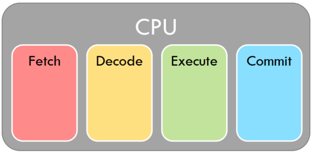 | 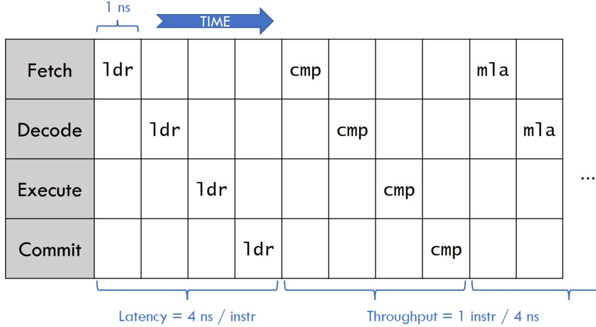 |
| ------------------------------------------------------------ | --------------------------------------------------------------------------------------- |

### **Pipelining**

  - 𝑁-stage pipeline gives up to 𝑁 × speedup(N = 15 是个临界点)
  - `Fetch/Decode/Execute/Commit` - 4X Speedup
  - 一些限制 Pipeling 并行的因素
      - **Data Hazards**
      - **Control Hazards**

| 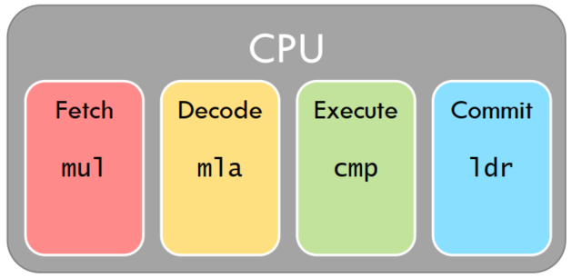 | 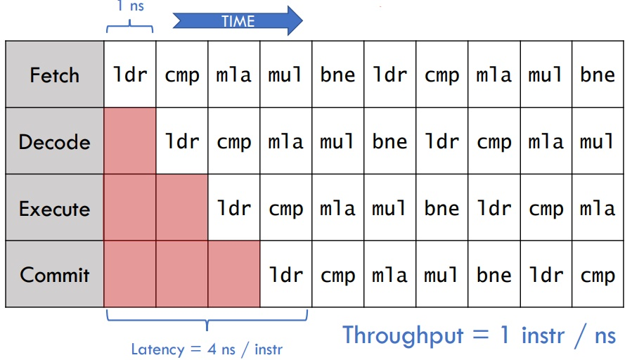 |
| ------------------------------------------------------------ | ---------------------------------------------------------------------------------- |

#### Data Hazards & Forwarding data

  - **Data hazards:**
      - 并行需要是独立的任务, 而许多指令之间并不独立(寄存器读写依赖)
      - 当后一条指令需要用到前一条指令的寄存器时会填充 `NOP` 指令, 以等到前一条指令 `commit`
      - **example:** 前一条指令要写 `R3`, 后一条指令执行时要读 `R3`, 后一条指令执行时,前一条指令还没有
        `commit`

| 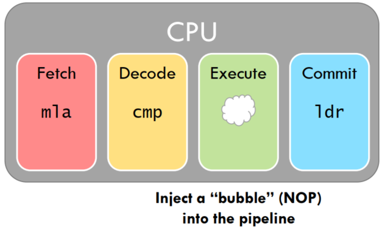 | 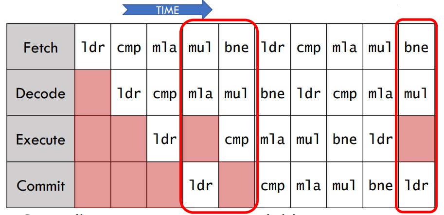 |
| ------------------------------------------------------------ | ---------------------------------------------------------------------------------- |

  - 解决方案: **Forwarding data** - CPU在一个时钟周期内，把一个单元的输出值内容拷贝到另一个单元的输入值中
      - Forwarding is expensive in deep pipelines

| 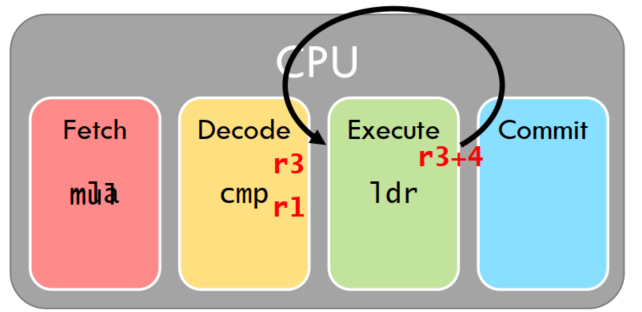 | 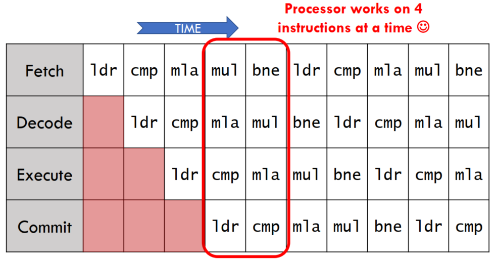 |
| ------------------------------------------------------------ | ------------------------------------------------------------ |

#### Control Hazards & Speculation

  - **Control Hazards** - 按照 `Static instruction sequence` 预取指令, 预取到错误指令
      - **example:** 前一条指令执行完跳转了, 提前 Fetch 的指令是错误的

| 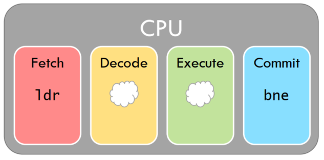 | 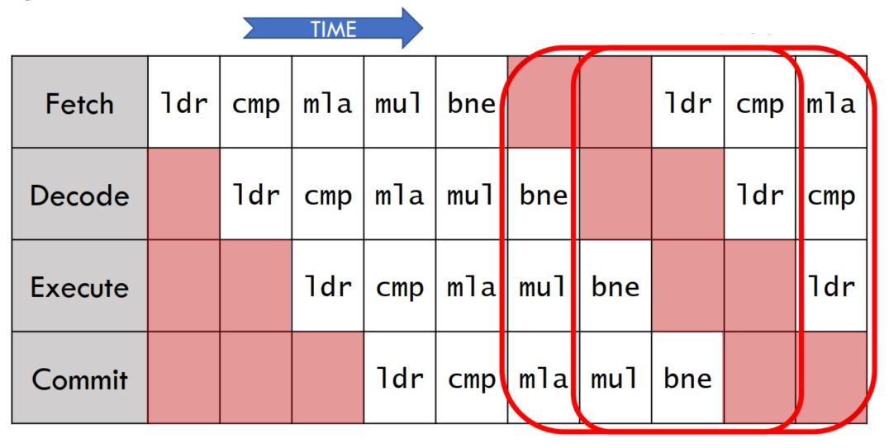 |
| ------------------------------------------------------------ | --------------------------------------------------------------------------------------- |

  - 解决方案: **Speculation** - CPU 猜测下一条要执行的指令 - 如果猜错, `rolling back`
      - > 95% 猜对？？

### Out-of-Order

  - **Out-Of-Order(OoO):** 乱序执行 - `执行已经准备好的指令`
  - **Dataflow:** 根据寄存器依赖并行执行
      - **True dependence:** `read-after-write`
  - **Latency Bound** - `Critical Path` - 迭代中最长路径
  - **Throughput Bound** - `Execution Unit 数量(并行执行指令的个数)/Structural
    hazards`
  - Out-of-Order 比 In-Order 对好代码更少限制

| 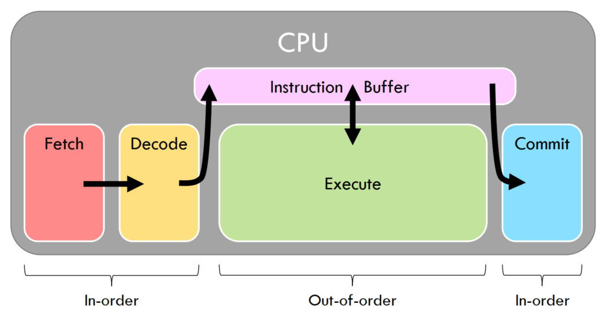 |  |
| ------------------------------------------------------------ | ------------------------------------------------------------ |

| 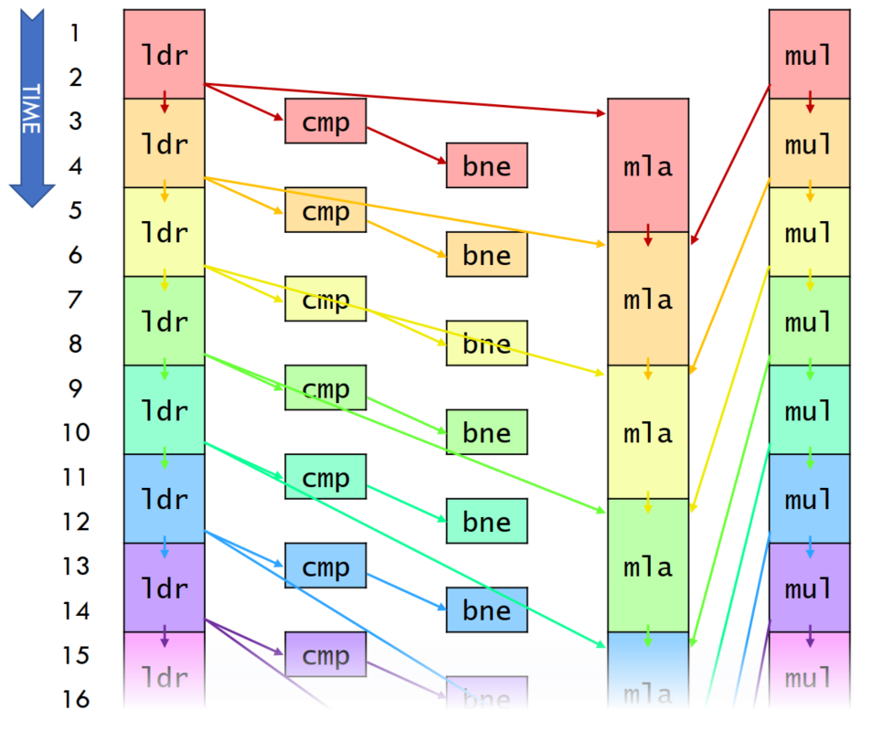 | 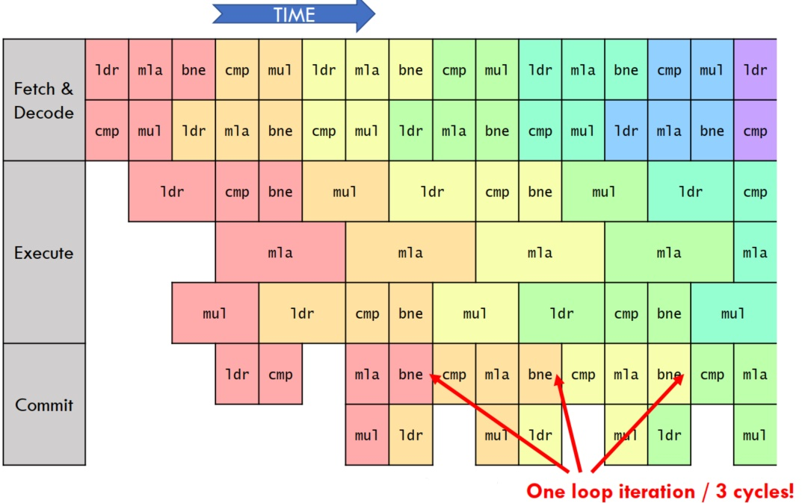 |
| ------------------------------------------------------------ | --------------------------------------------------------------------------------------- |

>   - ldr, mul execute in 2 cycles
>   - cmp, bne execute in 1 cycle
>   - mla executes in 3 cycles
>   - 每个循环执行 3 cycles, 一共 5 条指令
>   - IPC(Instructions per cycle) `= 5/3 =1.66... > 1`(perfect pipeling)

#### Structural hazard

  - **Structural hazard**: 浮点数/整数/Memory 特殊硬件资源有限

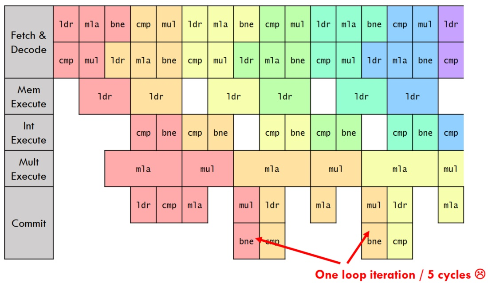

## Summary

  - ILP & Pipeline 扩展性不好/动态调度 & OoO 更复杂/代价更高
  - 并行指令是否独立需要 O(w2) 的比较, W= `issue width of processor`
  - Multicore 更 Efficient

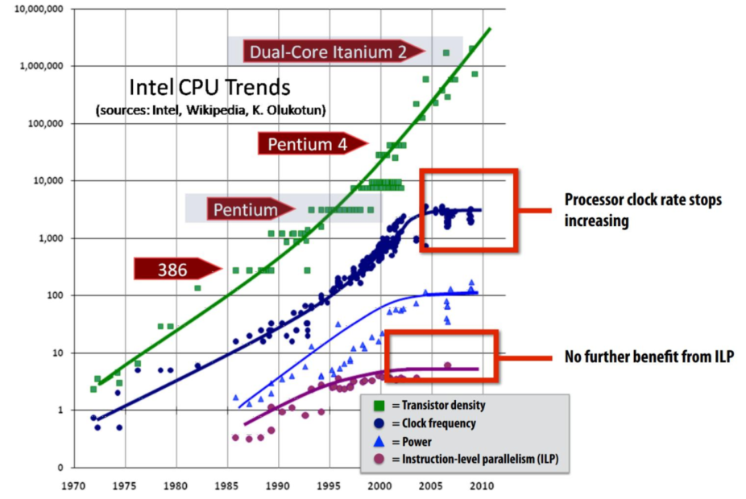
