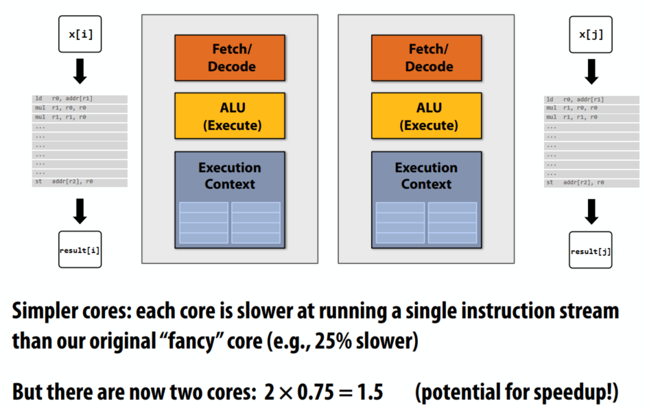
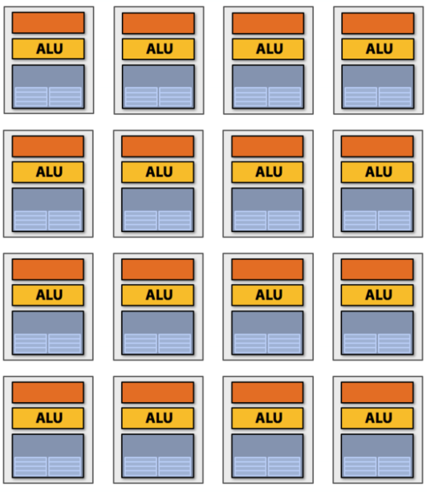
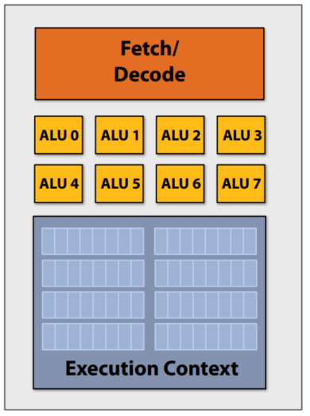
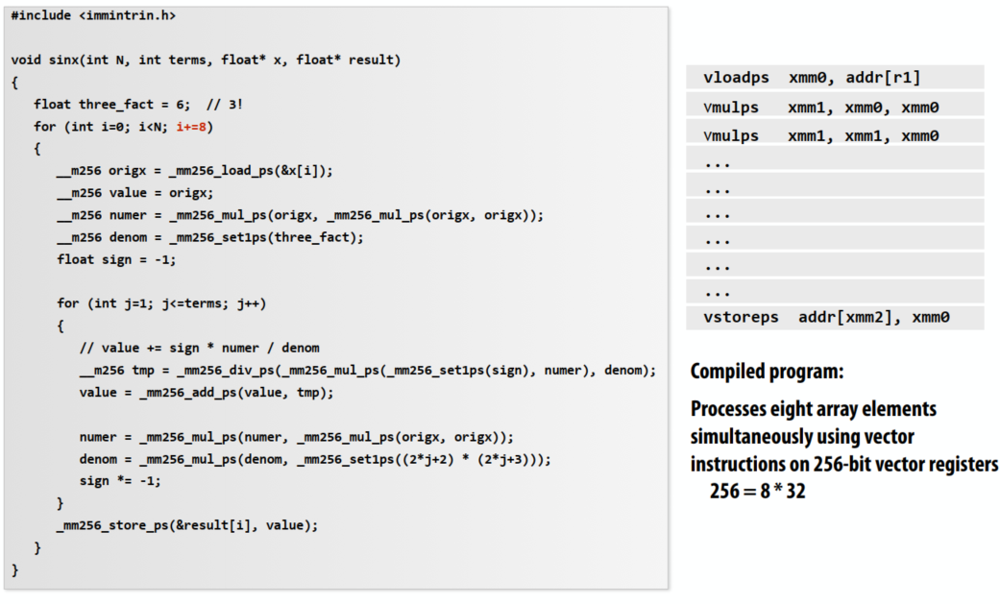
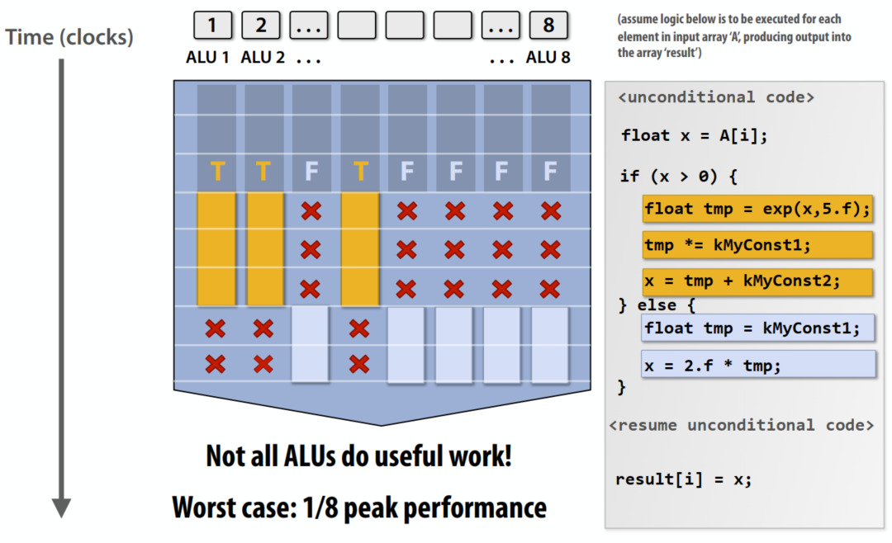
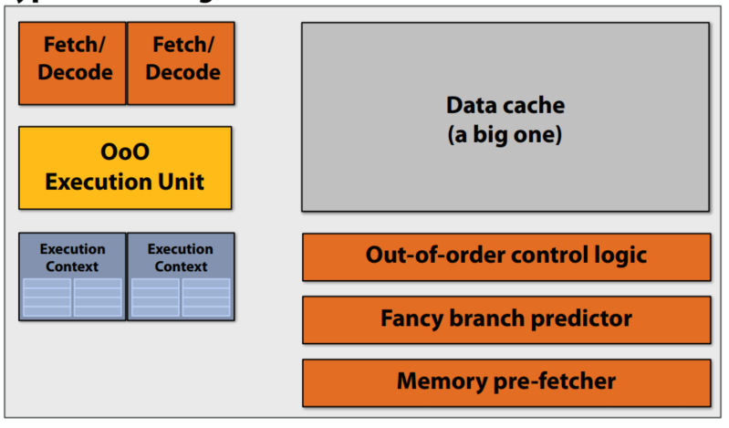
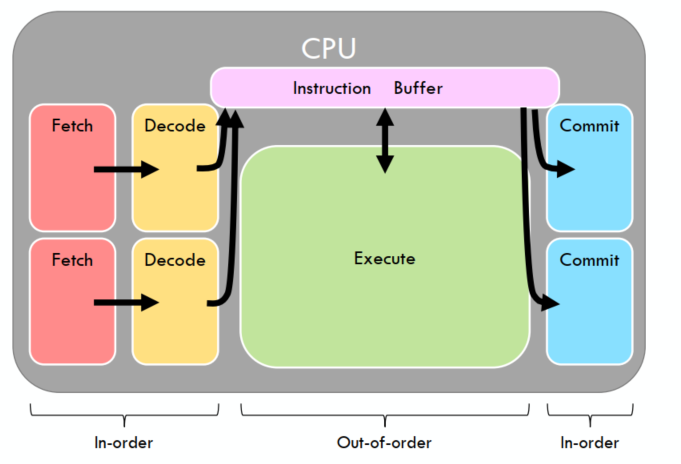
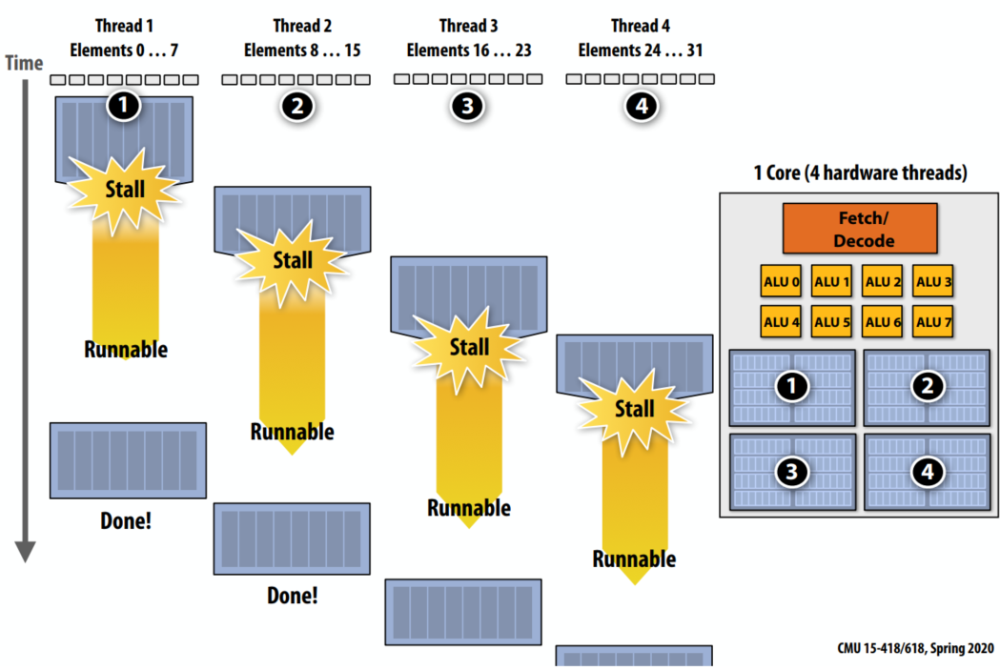
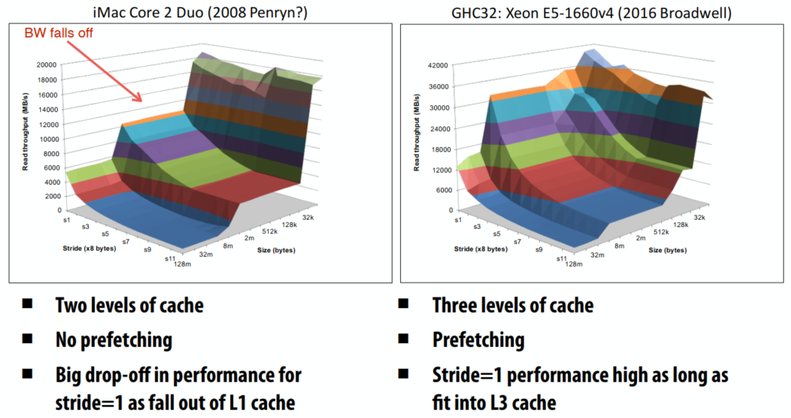

-----

| Title     | PCAP15418 3                                      |
| --------- | ------------------------------------------------ |
| Created @ | `2021-09-28T07:47:05Z`                           |
| Updated @ | `2023-07-16T08:48:21Z`                           |
| Labels    | \`\`                                             |
| Edit @    | [here](https://github.com/junxnone/csc/issues/5) |

-----

# CMU 15-418 Lecture 3 A Modern Multicore Processor

  - Multi-Core
  - SIMD
  - Hyperthreading
  - Memory

## Multi-Core

  - Thread-level
  - 每个 core 执行不同的指令

|  |  |
| ------------------------------------------------------------ | ------------------------------------------------------------ |

## SIMD

  - **SIMD Precessing**(Vector Program/Computing)
  - SIMD 并行化在编译时确定
  - Instruction-level/Data-Parallel
  - 每个 `core->ALUs` 执行 相同的指令
  - AVX intrinsics
      - SSE -\> AVX -\> AVX512
  - 32 --\>256(=32\*8) ==\> 同时处理 `8x` data

|  |  |
| ------------------------------------------------------------ | ------------------------------------------------------------ |

### SIMD Conditional execution

  - 当执行代码段存在条件判断时，不同的分支执行不同的指令, 会有一部分时间浪费掉
  - 不好的 code 会严重影响 SIMD 效率
      - `Instruction stream coherence` - 指令流的连续性影响 SIMD 的效率
      - `Divergent/Divergence` - 发散执行, 指缺乏连续性

## Hyperthreading & Interleaved multi-threading

  - Simultaneous Multi-Threading - **Hyperthreading** - 超线程
      - Single core does the work of multiple cores
  - `in-order` 部分独立, `Out-of-Order` 部分共享
  - 对单线程性能无提升，多线程性能有可能提升

|  |  |
| ------------------------------------------------------------ | ------------------------------------------------------------ |

| **Interleaved multi-threading**                              |
| ------------------------------------------------------------ |
|  |

> prefetching, multi-threading is a latency hiding, not a latency
> reducing technique ？？

## Memory

  - Latency(cycles/nsec) - `读取延迟`
  - Bandwidth (GB/s) - `读取最大速度`
  - **Stalls:** 运行下条指令时因为依赖不能运行
      - 内存访问是主要 Stalls
      - **Caches reduces stalls** 可以降低 memory access latency
      - **Prefetching reduces stalls:** Prefetching data into
        caches(prefetching 错误的话也会导致 performance 下降)
      - **Multi-Threading reduces stalls**
  - 解决方案
      - **L1/2/3 Cache** --\> DRAM: `Cache 有效减少了 内存访问时间`
      - **Prefetching data** 动态分析程序, 预测将要使用的 data(也会存在对performance坏的影响:
        占用带宽/污染缓存)
      - **Multi-threading** 当一个线程 stall,其他线程可以继续执行

|              **`L12` VS `L123 + Prefetching`**               |
| :----------------------------------------------------------: |
|  |
