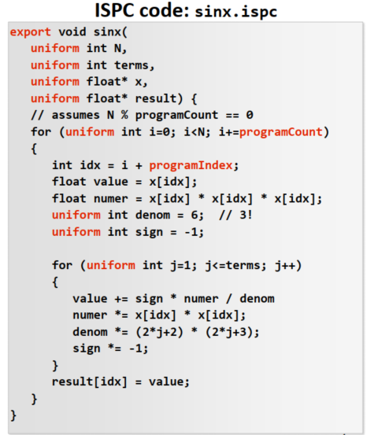
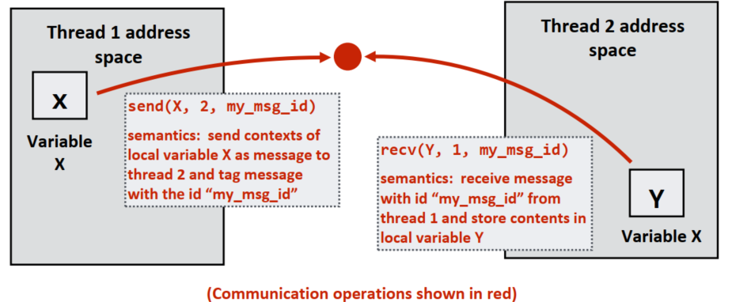

-----

| Title     | PCAP15418 4                                      |
| --------- | ------------------------------------------------ |
| Created @ | `2021-09-29T02:00:07Z`                           |
| Updated @ | `2024-01-30T02:30:27Z`                           |
| Labels    | \`\`                                             |
| Edit @    | [here](https://github.com/junxnone/csc/issues/7) |

-----

# 4 Parallel Programming Abstractions

## Reference

  - [ISPC](https://github.com/ispc/ispc)
    \[[docs](https://ispc.github.io/)\]

## Brief

  - SPMD - `single program, multiple data` - `Programming model`
  - ISPC - `Intel SPMD Program Compiler`
  - Programming models
  - **SMP** - `Symmetric multi-processor`
  - **NUMA** - `Non-uniform memory access`

## SPMD & ISPC

  - SPMD - `single program, multiple data`
  - ISPC - `Intel SPMD Program Compiler`
      - 用于编译串行 `C code` 到 `SIMD implementation` 程序 - `xxx.ispc` --\>
        `xxx.o`
  - **Program Instance**: 同时运行的程序 `single program`
  - **gang**: 一系列的 `Program Instance`
      - \= N x `Program Instance` - N 取决于 `SIMD width`
      - 用于 `one core` + SIMD
  - **task**: 用于 multi-core
      - 比 thread 更轻量
  - **ISPC supports parallelism**
      - **SPMD parallelism**: SIMD vector lanes on a single core
      - **task parallelism**: multiple processor cores

| Interleaved assignment                                       | Blocked assignment                                           |
| ------------------------------------------------------------ | ------------------------------------------------------------ |
|  |  |
|  |  |
|  |  |

## Programming models

  - Thread Programming model
  - ISPC Programming model

| System Layers Interface & Implementation |  |
| ---------------------------------------- | ------------------------------------------------------------ |
| Thread Programming model                 |  |
| ISPC Programming model                   |  |

  - 按照通信方式可以分为三种模型
  - 实际使用中会混合使用编程模型 `Shared Address Space` + `Message Passing`

| Model                    | Description                                     |
| ------------------------ | ----------------------------------------------- |
| **Shared address space** | \- 共享变量  非结构化数据  - 主动性更强？？                |
| **Message passing**      | \- 发送/接收消息  - 结构化数据                          |
| **Data parallel**        | \- SIMD Vector Processor - 通信受 iterations 限制 |

#### Shared Address Space Model

| Shared address space       |  |
| -------------------------- | ------------------------------------------------------------ |
| **SMP** HW Implementation  |  |
| **NUMA** HW Implementation |  |

| HW Arch | Description                                                                                                        |
| ------- | ------------------------------------------------------------------------------------------------------------------ |
| SMP     | \- 处理器通过 Interconnect 直接访问所有处理器 - 对所有处理器而言, 访问 DRAM 时间相同                                                        |
| NUMA    | \- 每个处理器拥有自己的Memory - 每个处理器可以通过 `Interconnect` 访问其他处理器的 Memory - 对本地内存的访问是 `low lantency` + `high bandwidth` |

  - SMP - Symmetric(shared-memory) multi-processor
  - NUMA - Non-uniform memory access
  - Interconnect
      - Hyper-transport - AMD
      - QuickPath (QPI) - Intel

#### Message Passing Model

  - MPI - `Message Passing Interface`
  - 通常用于机器集群

| Message passing |  |
| --------------- | ------------------------------------------------------------ |

#### Data Parallel Model

  - 一个函数处理大量的数据
  - HW support - Vector Processors - SIMD
  - SPMD Programming
  - Stream Programming
  - Languages - ISPC/OpenCL/CUDA

| ISPC-\> SPMD/SIMD |  |
| ----------------- | ------------------------------------------------------------ |

#### Stream Programming

  - Streams - Data
  - Kernels - 处理函数
  - Gather/Scatter

| Streams Programming | Description                                                       |
| ------------------- | ----------------------------------------------------------------- |
| Benefits            | \- 函数独立 - data 已知, prefetching 优势 - Cache 优势, 可以减少读写 Memory |
| Drawbacks           | Need library of operators to describe complex data flows ???      |
