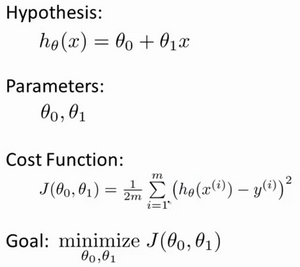
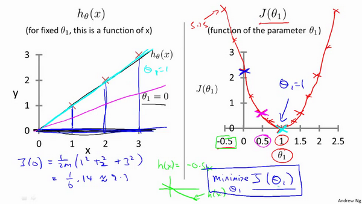
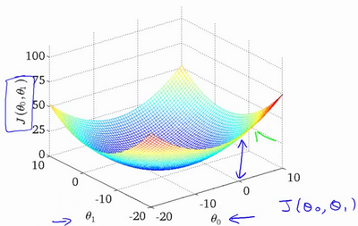
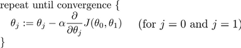
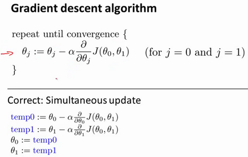

-----

| Title     | CS229 单变量线性回归                                     |
| --------- | ------------------------------------------------- |
| Created @ | `2019-07-18T14:00:59Z`                            |
| Updated @ | `2024-01-29T14:55:39Z`                            |
| Labels    | \`\`                                              |
| Edit @    | [here](https://github.com/junxnone/csc/issues/13) |

-----

## 1.单变量线性回归问题

  - 只含有一个特征(输入变量) 的回归问题

### 房价预测

  - **问题:** 房价和面积成正比, 建立一个通过面积预测房价的算法

| 定义                                     | 描述                          |
| -------------------------------------- | --------------------------- |
| $x$                                    | 输入(特征/面积)                   |
| $h\_\\theta(x)$                        | 输出(房价)                      |
| $h\_\\theta(x)=\\theta\_0+\\theta\_1x$ | 假设(Hypothesis)/(房价和面积的关系函数) |
| $\\theta\_0$ $\\theta\_1$              | 参数, 算法计算出最佳参数，更好的拟合数据       |

## 2.什么是代价函数？

代价函数也被称作平方误差函数，有时也被称为平方误差代价函数。  

## 3.代价函数的解法？

## 4.什么是梯度下降？

梯度下降是一个用来求函数最小值的算法。
开始时我们随机选择一个参数的组合，计算代价函数，然后我们寻找下一个能让代价函数值下降最多的参数组合。我们持续这么做直到找到一个局部最小值（local
minimum）。

> 因为我们并没有尝试完所有的参数组合，所以不能确定我们得到的局部最小值是否便是全局最小值（global
> minimum），选择不同的初始参数组合，可能会找到不同的局部最小值。

批量梯度下降（batch gradient descent）算法的公式为：  
  
其中α是学习率(learning
rate），它决定了我们沿着能让代价函数下降程度最大的方向向下迈出的步子有多大，在批量梯度下降中，我们每一次都同时让所有的参数减去学习速率乘以代价函数的导数。

## 5.梯度下降的求解方法？

# 6.什么是批量梯度下降？

在梯度下降的每一步中，我们都用到了所有的训练样本，在梯度下降中，在计算微分求导项时，我们需要进行求和运算，所以，在每一个单独的梯度下降中，我们最终都要计算这样一个东西，这个项需要对所有m个训练样本求和。因此，批量梯度下降法这个名字说明了我们需要考虑所有这一"批"训练样本，而事实上，有时也有其他类型的梯度下降法，不是这种"批量"型的，不考虑整个的训练集，而是每次只关注训练集中的一些小的子集。
