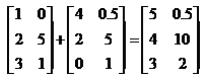
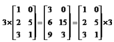
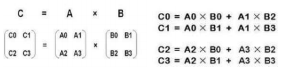
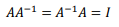
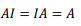
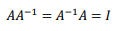
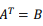

-----

| Title     | CS229 3                                           |
| --------- | ------------------------------------------------- |
| Created @ | `2019-07-18T14:01:28Z`                            |
| Updated @ | `2024-01-29T16:17:48Z`                            |
| Labels    | `bug`                                             |
| Edit @    | [here](https://github.com/junxnone/csc/issues/14) |

-----

# 3 多变量线性回归

## 1.矩阵如何相加？

## 2.矩阵如何和标量相乘？

## 3.矩阵的乘法规则？

𝑚 × 𝑛矩阵乘以𝑛 × t矩阵，变成𝑚 × t矩阵。  

矩阵的乘法不满足交换律：𝐴 × 𝐵 ≠ 𝐵 × 𝐴  
矩阵的乘法满足结合律。即：𝐴 × (𝐵 × 𝐶) = (𝐴 × 𝐵) × C

## 4.什么是单位矩阵？

在矩阵的乘法中，有一种矩阵起着特殊的作用，如同数的乘法中的 1,我们称 这种矩阵为单位矩阵．它是个方阵，一般用 𝐼 或者 𝐸 表示，本讲义都用
𝐼 代表单位矩阵，从左上角到右下角的对角线（称为主对角线）上的元素均为 1 以外全都为 0。  
  

## 5.什么是矩阵的逆？

矩阵的逆：如矩阵𝐴是一个𝑚 × 𝑚矩阵（方阵），如果有逆矩阵，则：  

## 6.什么是矩阵的转置？

矩阵的转置：设𝐴为𝑚 × 𝑛阶矩阵（即𝑚行𝑛列），第𝑖行𝑗列的元素是𝑎(𝑖,𝑗)，即：𝐴 = 𝑎(𝑖,𝑗) 定义𝐴的转置为这样一个𝑛 ×
𝑚阶矩阵𝐵，满足𝐵 = 𝑎(𝑗, 𝑖)，即 𝑏(𝑖,𝑗) = 𝑎(𝑗, 𝑖)（𝐵的第𝑖行
第𝑗列元素是𝐴的第𝑗行第𝑖列元素），记  

