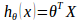

-----

| Title     | CS229 4                                           |
| --------- | ------------------------------------------------- |
| Created @ | `2019-07-18T14:01:51Z`                            |
| Updated @ | `2024-01-29T16:17:30Z`                            |
| Labels    | `bug`                                             |
| Edit @    | [here](https://github.com/junxnone/csc/issues/15) |

-----

# 4 多变量线性回归

## 1.多变量线性回归的假设

  
即 

## 2.多变量线性回归的代价函数

## 3.多变量线性回归的批量梯度下降算法

即：  

求导数后得到：  

更新参数：  
  
  
  
……  
……

## 4.特征缩放

> 面对多维特征问题的时候，我们要保证这些特征都具有相近的尺度，这将帮助梯度下降算法更快地收敛。

当两个特征有较大的数量级差异时，绘制代价函数的等高线图能，看出图像会显得很扁，梯度下降算法需要非常多次的迭代才能收敛。
解决的方法是尝试将所有特征的尺度都尽量缩放到-1到1之间。

## 5.学习率

  - 如果学习率过小，则达到收敛所需的迭代次数会非常高；
  - 如果学习率过大，每次迭代可能不会减小代价函数，可能会越过局部最小值导致无法收敛。

## 6.特征和多项式回归

线性回归并不适用于所有数据，有时我们需要曲线来适应我们的数据，比如二次方模型或者三次方模型：  

> 多项式回归模型，在运行梯度下降算法前，特征缩放非常有必要。

## 7.正规方程

对代价函数求导

> 对于那些不可逆的矩阵（通常是因为特征之间不独立，如同时包含英尺为单位的尺寸和米为单位的尺寸两个特征，也有可能是特征数量大于训练集的数量），正规方程方法是不能用的。

## 8.梯度下降与正规方程的比较

| 梯度下降           | 正规方程                                                                                                                                                                               |
| -------------- | ---------------------------------------------------------------------------------------------------------------------------------------------------------------------------------- |
| 需要选择学习率a       | 不需要                                                                                                                                                                                |
| 需要多次迭代         | 一次运算得出                                                                                                                                                                             |
| 当特征数量n大时也能较好适用 | 需要计算 如果特征数量n较大则运算代价大，因为矩阵逆的计算时间复杂度为，通常来说当n小于10000 时还是可以接受的 |
| 适用于各种类型的模型     | 只适用于线性模型，不适合逻辑回归模型等其他模型                                                                                                                                                            |
